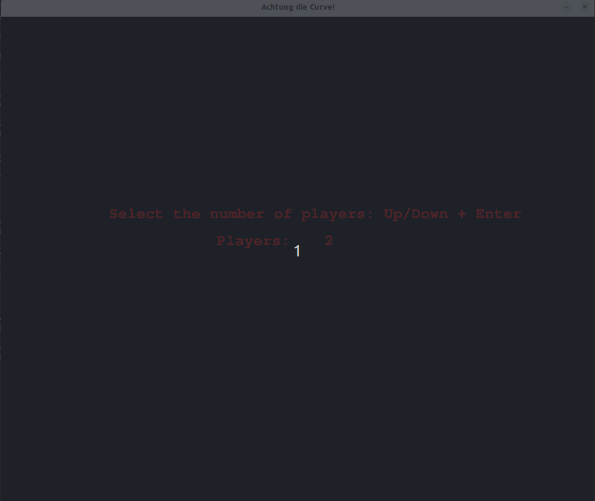

# Achtung, die Kurve!

Remake of the classical game [Achtung, die Kurve!](https://en.wikipedia.org/wiki/Achtung,_die_Kurve!)



# Run

Using the dependencies on your machine (not guarantied to work)

```bash
$ python3 game.py
```

Using a virtual environment:

```bash
$ python3 -m venv .venv
$ source .venv/bin/activate
$ (.venv) python -m pip install -r requirements.tx
$ (.venv) python game.py
```
